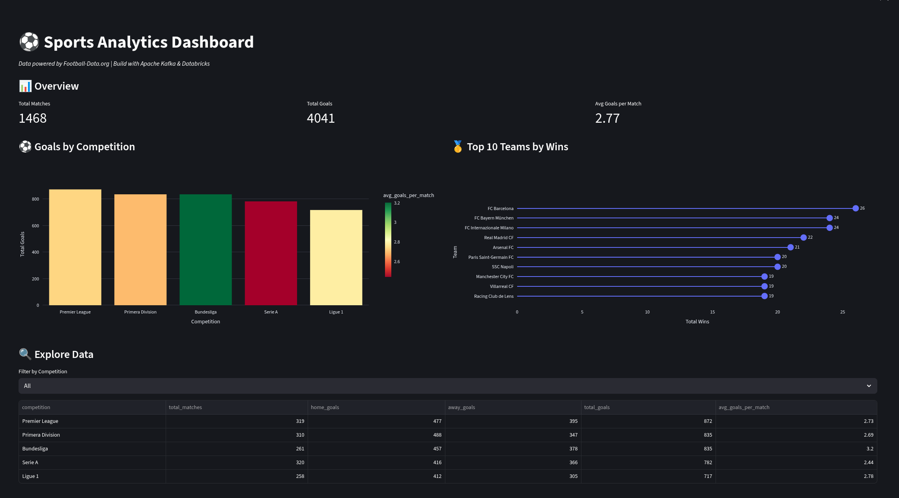
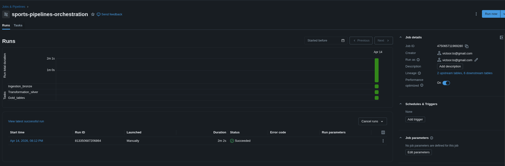
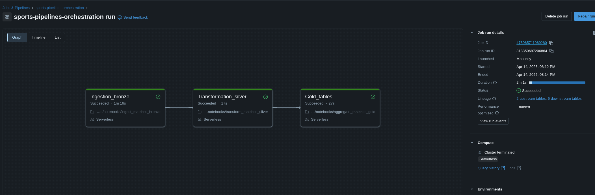

# ⚽ Sports Analytics Pipeline

A real-time data engineering pipeline that ingests live football match data from the Football-Data.org API, streams it through Apache Kafka, and processes it in Databricks following the Medallion Architecture.

## 📸 Dashboard Preview



## 🏗️ Architecture

Football-Data API → Apache Kafka → Databricks (Bronze → Silver → Gold) → Dashboard


## 🛠️ Tech Stack

- **Ingestion**: Python, Apache Kafka, REST API
- **Processing**: Apache Spark (PySpark), Databricks, Delta Tables, Apache Iceberg
- **Orchestration**: Apache Airflow and Databricks Jobs
- **Visualization**: Streamlit, Plotly
- **Infrastructure**: Docker, Docker Compose
- **Cloud**: Databricks Community Edition


## 📁 Project Structure

        sports-pipeline/
        |
        ├── docker/
        |   └── docker-compose.yml              # Kafka + Zookeeper setup
        |
        ├── ingestion/
        |   ├── producer.py                 # Fetches data from API and sends to Kafka
        |   ├── consumer.py                 # Kafka consumer for debugging
        |   └── kafka_to_json.py            # Saves Kafka messages to JSON files
        |
        ├── notebooks/
        |   ├── ingest_matches_bronze.py    # Raw data ingestion
        |   ├── transform_matches_silver.py # Data cleaning and enrichment
        |   └── aggregate_matches_gold.py   # Business aggregations
        |   └── streaming-variant-ingestion/
        |       └── ingest_matches_bronze_streaming.py        # Spark Structured Streaming (production variant)
        |      
        ├── Orchestration/
        |   └──sports-airflow-dags.py
        ├── .env.example
        ├── requirements.txt
        └── README.md

## 🥉🥈🥇 Medallion Architecture

| Layer | Table | Description |
|-------|-------|-------------|
| Bronze | `football_matches_bronze` | Raw data as received from the API |
| Silver | `football_matches_silver` | Cleaned data, typed columns, enriched with match result |
| Gold | `football_wins_gold` | Teams ranked by total wins |
| Gold | `football_goals_gold` | Goals and averages per competition |
| Gold | `football_results_gold` | Distribution of match results |

## 🔀 Infrastructure Variants

This project supports two deployment modes depending on available infrastructure:

### Community Edition / Local
| Component | Tool |
|-----------|------|
| Kafka | Docker (local) |
| Ingestion | JSON files as intermediate layer |
| Orchestration | Databricks Jobs | 

### Production
| Component | Tool |
|-----------|------|
| Kafka | Confluent Cloud / Azure Event Hubs |
| Ingestion | Spark Structured Streaming directly into Databricks |
| Orchestration | Apache Airflow or Databricks Jobs |

The production variant files are included in the repository for reference:
- `notebooks/streaming-variant-ingestion/ingest_matches_bronze_streaming.py` — Streaming Bronze notebook
- `orchestration/sports_pipeline_dag.py` — Airflow DAG

## 🚀 Getting Started

### Prerequisites
- Docker and Docker Compose
- Python 3.8+
- Databricks Community Edition account
- Football-Data.org API key (free tier)

### 1. Clone the repository
```bash
git clone https://github.com/tu-usuario/sports-pipeline.git
cd sports-pipeline
```

### 2. Set up environment variables
```bash
cp .env.example .env
# Edit .env and add your API key
```

### 3. Start Kafka
```bash
cd docker
docker-compose up -d
```

### 4. Run the producer
```bash
cd ingestion
python producer.py
```

### 5. Save Kafka messages to JSON
```bash
python ingestion/kafka_to_json.py
```

### 6. Upload JSON to Databricks
Upload the generated file from `data/` to your Databricks volume and run the notebooks in order:
1. `ingest_matches_bronze.py`
2. `transform_matches_silver.py`
3. `aggregate_matches_gold.py`

### 7. Do the Orchestration with Databricks Jobs





## 📊 Running the Dashboard

```bash
streamlit run dashboard/app.py
```

Then open your browser at `http://localhost:8501`


## 📊 Data Coverage

- **Competitions**: Premier League, La Liga, Bundesliga, Serie A, Ligue 1
- **Records**: ~1,468 finished matches
- **Source**: [Football-Data.org](https://www.football-data.org/)

## 👤 Author

**Victor Tapia**  
Junior Data Engineer  
[LinkedIn](https://www.linkedin.com/in/victoorto/) | [GitHub](https://github.com/Victoorto)